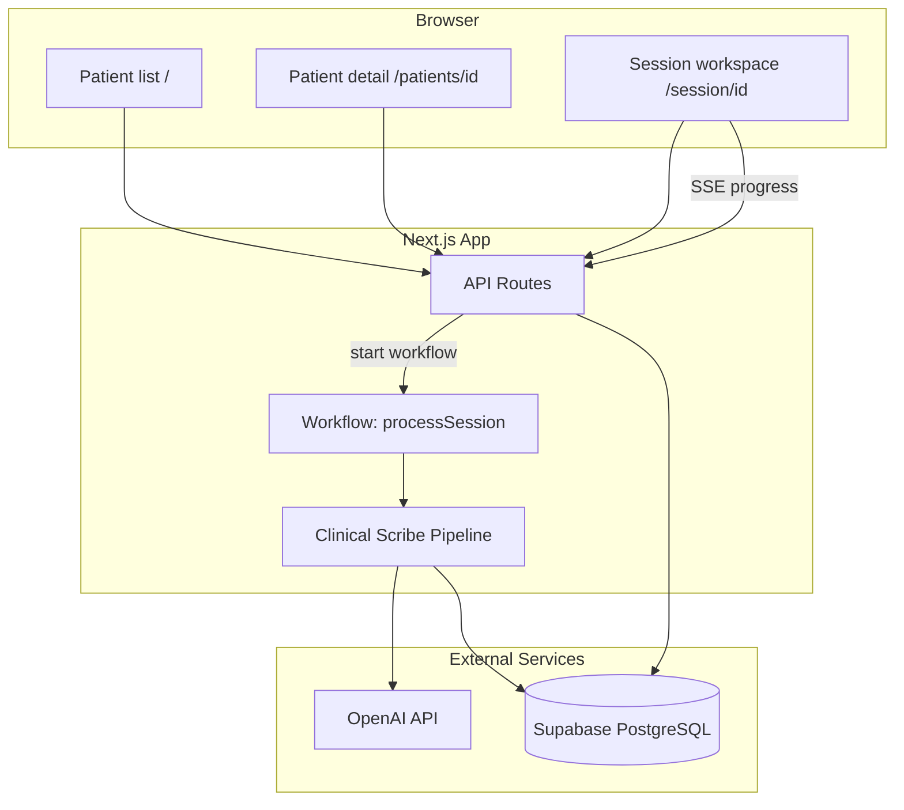
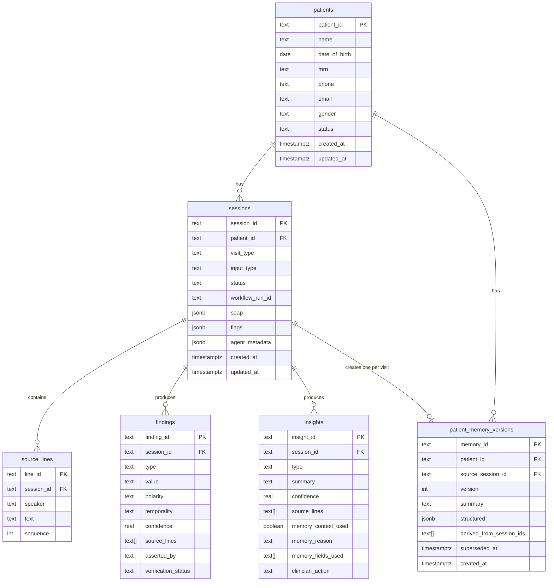
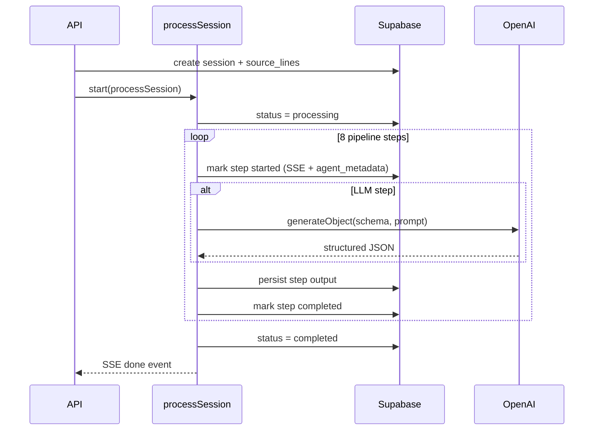
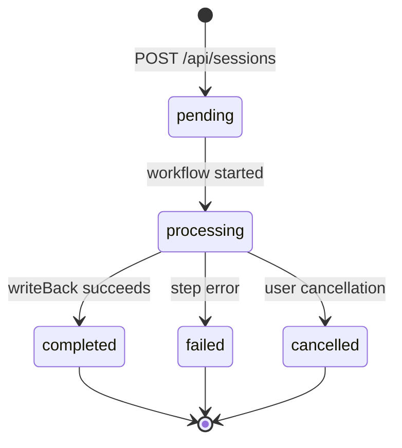

# System Architecture

AI Clinical Scribe — a Next.js prototype that ingests clinical visit transcripts (or PDFs / doctor notes), runs a durable multi-step AI pipeline, and produces structured findings, SOAP notes, clinical insights, and versioned longitudinal patient memory.

---

## Tech Stack

| Layer | Technology |
|-------|------------|
| Framework | Next.js 16 (App Router) |
| UI | React 19, Tailwind CSS 4, shadcn/ui |
| Database | Supabase (PostgreSQL) |
| AI | Vercel AI SDK (`generateObject`) + OpenAI (`gpt-5.3-chat-latest`) |
| Orchestration | Vercel Workflow SDK (`workflow` package) — durable, resumable steps |
| Validation | Zod 4 |

---

## High-Level Architecture



**Request path for a new session:**

1. Client POSTs transcript/PDF to `/api/sessions`.
2. API segments raw text into `source_lines`, creates a `sessions` row, and starts `processSession` workflow.
3. Workflow runs eight pipeline steps (each a durable `"use step"` function).
4. Client subscribes to `/api/sessions/[id]/progress` (SSE) for live step updates.
5. On completion, client fetches `/api/sessions/[id]` and renders the session workspace.

---

## Database Schema

All tables live in Supabase PostgreSQL. Migrations are in `supabase/migrations/`.

### Entity Relationship



### Table Reference

#### `patients`

Demographics and list-card metadata for the patient roster.

| Column | Type | Notes |
|--------|------|-------|
| `patient_id` | `text` PK | Application-generated UUID or slug |
| `name` | `text` | Display name |
| `date_of_birth` | `date` | Optional |
| `mrn` | `text` | Medical record number; unique when set |
| `phone`, `email` | `text` | Contact info |
| `gender` | `text` | `male` \| `female` \| `other` \| `unknown` |
| `status` | `text` | `active` \| `inactive` \| `new` \| `archived` |

#### `sessions`

One clinical visit / documentation run. Central hub for pipeline state and outputs.

| Column | Type | Notes |
|--------|------|-------|
| `session_id` | `text` PK | UUID |
| `patient_id` | `text` FK → `patients` | Cascade delete |
| `visit_type` | `text` | e.g. `general_adult_outpatient`, `follow_up`, `chronic_care` |
| `input_type` | `text` | `transcript` \| `doctor_notes` \| `pdf` |
| `status` | `text` | `pending` \| `processing` \| `completed` \| `failed` \| `cancelled` |
| `workflow_run_id` | `text` | Vercel Workflow run ID for progress streaming |
| `soap` | `jsonb` | Four sections: `subjective`, `objective`, `assessment`, `plan` — each `{ narrative, finding_ids[] }` |
| `flags` | `jsonb` | Completeness flags: `missing_fields`, `contradictions`, `low_confidence` |
| `agent_metadata` | `jsonb` | Pipeline progress, cached patient memory snapshot, symptom recurrence, edit log |

**`agent_metadata` shape** (application-level, not enforced by DB):

```json
{
  "edit_log": [{ "field": "soap", "old_value": {}, "new_value": {}, "edited_at": "..." }],
  "pipeline_progress": {
    "current_step": "generateInsights",
    "completed_steps": ["extractFindings", "verifyFindings"],
    "failed_step": null,
    "error_message": null
  },
  "patient_memory": { "memory_id": "...", "version": 2, "summary": "...", "structured": {} },
  "symptom_recurrence": [{ "finding_type": "symptom.chest_pain", "session_count": 3, "session_ids": [] }],
  "created_memory_id": "..."
}
```

#### `source_lines`

Segmented transcript lines — the citation backbone for findings, insights, and the UI transcript panel.

| Column | Type | Notes |
|--------|------|-------|
| `line_id` | `text` PK | Format `{session_id}:L{n}` |
| `session_id` | `text` FK | |
| `speaker` | `text` | e.g. `patient`, `doctor` |
| `text` | `text` | Utterance content |
| `sequence` | `int` | Order within session; unique per `(session_id, sequence)` |

#### `findings`

Structured clinical facts extracted from the transcript.

| Column | Type | Notes |
|--------|------|-------|
| `finding_id` | `text` PK | UUID |
| `session_id` | `text` FK | |
| `type` | `text` | Dot-notation, e.g. `symptom.chest_pain`, `plan.follow_up` |
| `value` | `text` | Human-readable fact |
| `polarity` | `text` | `present` \| `absent` \| `denied` \| `uncertain` |
| `temporality` | `text` | `current` \| `historical` \| `resolved` \| `unknown` |
| `confidence` | `real` | 0–1 |
| `source_lines` | `text[]` | Citations into `source_lines.line_id` |
| `asserted_by` | `text` | `patient` \| `clinician` \| `system` \| `unknown` |
| `verification_status` | `text` | `verified` \| `unverified` \| `contradicted` |

#### `insights`

Actionable clinical observations beyond summarization.

| Column | Type | Notes |
|--------|------|-------|
| `insight_id` | `text` PK | UUID |
| `session_id` | `text` FK | |
| `type` | `text` | `omission_risk` \| `longitudinal_pattern` \| `safety_triage` \| `completeness` \| `general` |
| `summary` | `text` | 1–2 sentence clinical observation |
| `confidence` | `real` | 0–1 |
| `source_lines` | `text[]` | Session citations |
| `memory_context_used` | `boolean` | Whether prior patient memory informed this insight |
| `memory_reason` | `text` | Explanation when memory was used |
| `memory_fields_used` | `text[]` | e.g. `active_problems`, `medications` |
| `clinician_action` | `text` | Recommended next step |

#### `patient_memory_versions`

Versioned longitudinal patient context. Replaces an earlier graph-RAG approach; only the latest non-superseded row per patient is active.

| Column | Type | Notes |
|--------|------|-------|
| `memory_id` | `text` PK | UUID |
| `patient_id` | `text` FK | |
| `source_session_id` | `text` FK → `sessions` | Visit that produced this version |
| `version` | `int` | Monotonic per patient; unique `(patient_id, version)` |
| `summary` | `text` | 2–4 sentence prose summary |
| `structured` | `jsonb` | `active_problems`, `chronic_conditions`, `medications`, `allergies`, `social_history`, `recent_visits[]` |
| `derived_from_session_ids` | `text[]` | All sessions contributing to this memory |
| `superseded_at` | `timestamptz` | Set when a newer version is created; `NULL` = current |

### Indexes

| Index | Table | Purpose |
|-------|-------|---------|
| `idx_sessions_patient` | `sessions` | Patient session history |
| `idx_sessions_status` | `sessions` | Filter by pipeline status |
| `idx_source_lines_session` | `source_lines` | Load transcript |
| `idx_findings_session`, `idx_findings_type` | `findings` | Session + symptom queries |
| `idx_insights_session` | `insights` | Load insights |
| `idx_patients_mrn` | `patients` | Unique MRN lookup |
| `idx_memory_patient_latest` | `patient_memory_versions` | Partial index where `superseded_at IS NULL` |
| `idx_memory_patient_id` | `patient_memory_versions` | Patient memory history |

---

## Clinical Scribe Pipeline

Defined in `agent/workflow.ts`, orchestrated by `workflows/process-session.ts` as a Vercel Workflow (`"use workflow"`). Each step is a durable function (`"use step"`) that can survive restarts and retries.



### Pipeline Steps

| # | Step ID | Type | Description |
|---|---------|------|-------------|
| 1 | `extractFindings` | LLM | Extract structured clinical facts from `source_lines` |
| 2 | `verifyFindings` | Rules + DB | Cross-check citations; set `verification_status` |
| 3 | `structureSoap` | LLM | Build SOAP note sections linked to finding IDs |
| 4 | `flagCompleteness` | Rules | Detect missing fields, contradictions, low-confidence findings → `sessions.flags` |
| 5 | `loadPatientMemory` | DB | Load latest `patient_memory_versions` + symptom recurrence across prior sessions |
| 6 | `generateInsights` | LLM + Rules | LLM insights merged with rule-based safety/longitudinal insights |
| 7 | `updatePatientMemory` | LLM + DB | Merge visit into new `patient_memory_versions` row; supersede prior |
| 8 | `writeBack` | DB | Validate outputs exist; set `sessions.status = completed` |

**Pre-pipeline (synchronous, in API route):** `segmentTranscript` splits raw text into `source_lines` before the workflow starts. Speaker detection handles both line-broken transcripts and collapsed PDF text.

**Rule-based supplements** (`lib/decisions.ts`):

- Safety triage gaps for red-flag symptoms without plan items
- Longitudinal symptom recurrence patterns (from `symptom_recurrence` in agent metadata)
- Contradiction and low-confidence partitioning during verification/completeness

---

## API Layer

| Method | Route | Purpose |
|--------|-------|---------|
| `GET` | `/api/patients` | List patients with session counts and recent visits |
| `GET` | `/api/patients/[id]` | Single patient detail |
| `GET` | `/api/sessions` | List recent sessions |
| `POST` | `/api/sessions` | Create session (JSON or multipart PDF), segment transcript, start workflow |
| `GET` | `/api/sessions/[id]` | Full session detail: session + source_lines + findings + insights + patient |
| `PATCH` | `/api/sessions/[id]` | Clinician edits to SOAP narrative; append to `edit_log` |
| `GET` | `/api/sessions/[id]/progress` | SSE stream of pipeline progress events |

### Progress Streaming

Pipeline steps emit events via Vercel Workflow's writable stream (`PIPELINE_STREAM_NAMESPACE`). The progress route:

1. Attaches to the workflow run's readable stream when status is `processing`.
2. Falls back to a single terminal SSE event for completed/failed/cancelled sessions.
3. Reconciles orphaned runs (workflow expired but session still active) into `failed` status.

Event types: `init`, `step_start`, `step_complete`, `done`, `failed`, `cancelled`.

---

## Frontend

### Routes

| Path | Component | Role |
|------|-----------|------|
| `/` | Patient list | Search, sort, filter patients; link to sessions |
| `/patients/[id]` | Patient detail | Profile, session history, create new session |
| `/session/[id]` | `SessionWorkspace` | Live processing timeline or completed review UI |

### Session Workspace (completed state)

- **Transcript panel** — source lines with speaker labels; click-to-cite
- **SOAP note editor** — editable narratives persisted via PATCH
- **Insights panel** — typed insights with memory attribution and clinician actions
- **Citation linking** — `CitationProvider` connects insight/finding citations to transcript lines

### Data fetching

`hooks/use-session.ts`:

- Fetches session detail from API
- Subscribes to SSE progress while `pending` / `processing`
- Adapts API response → UI view model via `lib/adapters/session-to-ui.ts`
- Uses optimistic pending hints (`lib/session-pending-hint.ts`) for instant navigation after session creation

---

## AI Integration

- **Model:** `openai("gpt-5.3-chat-latest")` via `@ai-sdk/openai` (`lib/ai.ts`)
- **Pattern:** `generateObject({ model, schema, prompt })` for structured outputs
- **Schemas:** Zod schemas in `lib/schema.ts`; LLM-facing schemas (`*LlmSchema`) require **all fields** in OpenAI strict mode — use empty strings/arrays for optional semantics
- **Prompts:** `agent/prompts.ts` — one builder per LLM step

### Citation resolution

LLMs often shorten line IDs (e.g. `L4` instead of `{uuid}:L4`). `resolveSourceLineIds` in extraction and insight tools maps suffixes back to canonical `source_lines.line_id` values to keep the citation graph intact.

---

## Key Directories

```
app/                    Next.js pages and API routes
  api/                  REST endpoints
  patients/             Patient detail page
  session/              Session workspace page

agent/
  workflow.ts           Pipeline step sequence
  prompts.ts            LLM prompt templates
  tools/                One file per pipeline step (execute + tool definition)

workflows/
  process-session.ts    Vercel Workflow entry point

lib/
  db.ts                 Supabase client and all data access
  schema.ts             Zod schemas (DB + API + LLM)
  memory.ts             Patient memory helpers
  decisions.ts          Rule-based insights and verification logic
  pipeline-*.ts         Progress tracking and SSE streaming
  adapters/             API → UI view model transforms

components/clinical/    Domain UI (SOAP editor, insights, transcript, timeline)
supabase/migrations/    PostgreSQL schema evolution
```

---

## Session Lifecycle



**Completion invariants** (`writeBack` step):

- At least one finding persisted
- SOAP note generated on session
- Patient memory version created for this session

---

## Environment Variables

| Variable | Purpose |
|----------|---------|
| `SUPABASE_URL` | Supabase project URL |
| `SUPABASE_SECRET_KEY` / `SUPABASE_SERVICE_ROLE_KEY` | Server-side DB access |
| `OPENAI_API_KEY` | Required by AI SDK (standard env) |

---

## Design Decisions

1. **Postgres over graph DB for memory** — `patient_memory_versions` provides versioned longitudinal context with simpler ops; insights reference memory via `memory_context_used` rather than live graph queries.

2. **Durable workflows** — Long-running LLM pipelines survive server restarts; each step is independently retriable.

3. **Citations as first-class data** — Every finding and insight links to `source_lines`, enabling click-to-source in the UI and verification passes.

4. **Hybrid intelligence** — LLM extraction/structuring plus deterministic rules for safety gaps, contradictions, and symptom recurrence.

5. **JSONB for flexible artifacts** — SOAP, flags, and agent metadata evolve without migrations; relational tables hold queryable clinical facts.
