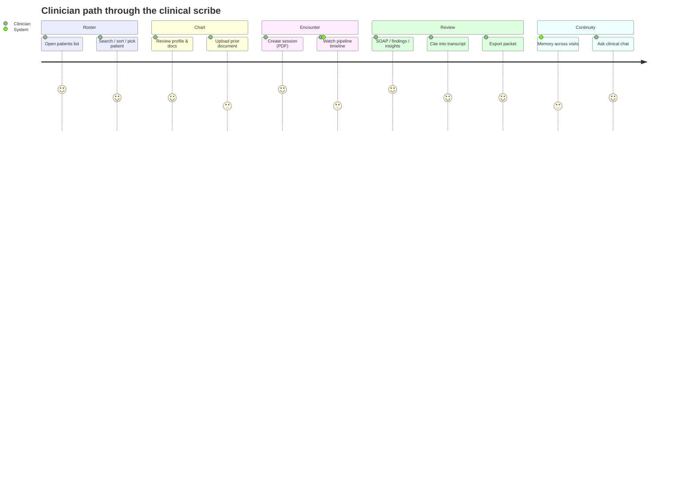
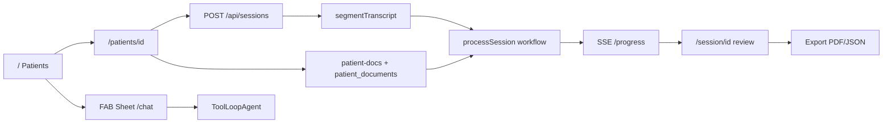

# Customer Journey — AI Clinical Scribe

End-to-end clinician journey through the prototype as implemented today. Audience: engineers and product. Companion to [`ARCHITECTURE.md`](./ARCHITECTURE.md) and [`FEATURES.md`](./FEATURES.md).

**Out of scope (not implemented):** patient portal, login/RBAC, multi-tenant tenancy, EHR write-back to an external system.

---

## Architectural actors

| Actor | Role in the journey |
|-------|---------------------|
| **Next.js App Router** | Pages (`/`, `/patients/[id]`, `/session/[id]`, `/chat`) and API routes |
| **Supabase Postgres** | Patients, sessions, source lines, findings, insights, `patient_documents`, `patient_memory_versions` |
| **Supabase Storage** | Bucket `patient-docs` for uploaded labs/reports |
| **Vercel Workflow SDK** | Durable `processSession` workflow (`"use workflow"` / `"use step"`) |
| **AI SDK** | Pipeline: `generateObject` for structured LLM steps; chat: `ToolLoopAgent` + `createAgentUIStreamResponse` |

---

## 1. Discovery / roster — `/`

The clinician lands on the **Patients** list (`app/page.tsx`), wrapped in `ClinicalShell`.

- Data: `GET /api/patients` (falls back to mock cards if the request fails).
- **Search** filters by name, MRN, phone, email, DOB.
- **Sort**: last updated, name A–Z, name Z–A.
- Each card links into the patient profile (`/patients/[id]`).
- A fixed **FAB** (`CW`) opens a right-side **Sheet** hosting `ClinicalChat` (drawer variant) — same assistant as `/chat`, without leaving the roster.

This is the roster / discovery surface: find a chart, or ask the assistant before diving in.

---

## 2. Patient profile — `/patients/[id]`

`GET /api/patients/[id]` loads demographics plus session history. The page shows an identity card (MRN, DOB/age, gender, contact) and two tabs:

| Tab | Content |
|-----|---------|
| **Sessions** | Searchable list of visits with status badges; empty state CTA to create a session |
| **Documents** | `PatientDocumentsSection` — upload, list, download, delete |

### Document upload

Upload opens a **Dialog** (title, `doc_type`: lab / imaging / referral / discharge / other, file).

- API: `POST /api/patients/[id]/documents` (multipart; max 20MB).
- Allowed MIME: PDF or common images (JPEG, PNG, WebP, GIF, HEIC/HEIF).
- Binary → Supabase Storage bucket **`patient-docs`** at `{patientId}/{documentId}-{filename}`.
- Metadata + optional extracted text/summary → Postgres **`patient_documents`**.
- PDFs: text extraction + `generateObject` clinical summary when text is available; image-only / scanned PDFs may store the file without text.

These documents later feed the scribe pipeline (`loadPatientDocuments`) and the chatbot (`listDocuments` / `readDocument`).

---

## 3. Session creation

From the profile, **Create session** opens `CreateSessionDialog`.

**UI today:** multipart PDF upload (`visit_type` defaults to `general_adult_outpatient`), then navigate to `/session/[session_id]`.

**API contract (`POST /api/sessions`):**

| Mode | Behavior |
|------|----------|
| `multipart/form-data` | PDF → `extractTextFromPdf` → `input_type: "pdf"` |
| JSON body | `CreateSessionRequestSchema`: `input_type` ∈ `transcript` \| `doctor_notes` \| `pdf` + `raw_text` |

Flow after accept:

1. Create `sessions` row (`status: pending`).
2. **`segmentTranscript`** → insert `source_lines` (speaker-aware segmentation for line-broken and collapsed PDF text).
3. `start(processSession, …)` via Workflow API; persist `workflow_run_id`; set `status: processing`.
4. Client writes an optimistic pending hint and routes to `/session/[id]`.

---

## 4. Processing — `/session/[id]` timeline

While `status` is `pending` or `processing` (also `failed` / `cancelled` / error surfaces), `SessionWorkspace` renders **`SessionProcessingTimeline`** instead of the review UI.

Live updates: **SSE** `GET /api/sessions/[id]/progress` (workflow stream + terminal reconciliation for completed/failed/cancelled). Event types include `init`, `step_start`, `step_complete`, `done`, `failed`, `cancelled`.

### Pipeline (`agent/workflow.ts` ← `workflows/process-session.ts`)

| Step ID | What happens |
|---------|----------------|
| `extractFindings` | LLM extracts structured findings from `source_lines` |
| `verifyFindings` | Grounds citations via **evidence spans**, **clinical aliases**, and **NegEx** (negation / uncertainty / clinician-question patterns); sets verification polarity |
| `structureSoap` | LLM builds Subjective / Objective / Assessment / Plan linked to findings |
| `flagCompleteness` | Rules flag gaps / contradictions → `sessions.flags` |
| `loadPatientMemory` | Latest non-superseded `patient_memory_versions` (+ recurrence signals) into agent metadata |
| `loadPatientDocuments` | Bounded prior docs (ids + summaries) from `patient_documents` into agent metadata |
| `generateInsights` | LLM + rule-based insights (omission risk, diagnostic consideration, longitudinal pattern) |
| `updatePatientMemory` | Merge visit → new `patient_memory_versions` row; supersede prior |
| `writeBack` | Completion invariants; `sessions.status = completed` |

### Session statuses

`pending` → `processing` → `completed` | `failed` | `cancelled`

---

## 5. Review workspace — `/session/[id]` (completed)

On `completed`, the workspace assembles:

- **`SessionHeader`** — patient link, visit context, transcript toggle, **Export** (when complete).
- **`InsightsPanel`** — typed insight cards; **Patient memory** badges open attribution (`memory_reason` / fields); source badges jump into the transcript via `CitationProvider`.
- **`SoapNoteEditor`** — SOAP **tabs**; each finding is a **category chip** + citeable text (`FindingListItem` / `CitationText`).
- **`TranscriptSheet`** — bottom sheet of `source_lines` with speaker labels; citation clicks scroll/highlight supporting lines.

Clinician job here: skim insights, verify SOAP findings against source, then export or return to the chart.

---

## 6. Export / share

From the header: **Export → PDF** or **JSON** → `GET /api/sessions/[id]/export?format=pdf|json` (409 unless `status === completed`).

| Format | Payload |
|--------|---------|
| **PDF** | `buildPatientPacket` → `@react-pdf` visit summary: demographics, SOAP narratives + verified findings, insight summaries (no raw transcript / confidence / agent metadata) |
| **JSON** | Full session detail plus memory for that visit (`patient_memory_versions` by source session, or metadata fallback) |

---

## 7. Longitudinal memory

Across visits, `updatePatientMemory` maintains versioned rows in **`patient_memory_versions`**:

- Monotonic `version` per patient; active row has `superseded_at IS NULL`.
- Prose `summary` + structured fields (`active_problems`, `chronic_conditions`, `medications`, `allergies`, `social_history`, `recent_visits[]`).
- Tied to `source_session_id`; `derived_from_session_ids` accumulates contributing visits.

Next encounter’s `loadPatientMemory` / `generateInsights` use the latest version so insights can cite memory (UI badge + dialog) without a separate patient-facing portal.

---

## 8. Clinician chatbot — FAB Sheet / `/chat`

Two entry points, one agent:

- **FAB Sheet** on any `ClinicalShell` page (drawer).
- Full page **`/chat`**.

Backend: `POST /api/chat` → `createAgentUIStreamResponse` over **`clinicalAssistant`** (`ToolLoopAgent` in `lib/agents/clinical-assistant.ts`), with `sendReasoning: true`.

**Tools:** `listPatients`, `searchSessions`, `getSessionSummary`, `getPatientMemory`, `listDocuments`, `readDocument`, `askClarifyingQuestion`.

**Human approval (PHI gates):**

- `readDocument` — always requires user approval (full document text).
- `getSessionSummary` / `getPatientMemory` — free when the target matches a **pinned patient**; otherwise user approval (cross-patient PHI).

UI streams **reasoning** parts and renders assistant markdown via **typeset** (`.typeset` / `.typeset-chat`). Optional patient pin scopes default lookups and relaxes same-patient tool approval.

---

## Journey snapshot

1. **Roster** → find patient (or ask chat).
2. **Chart** → review sessions / upload prior docs to `patient-docs`.
3. **Create** → PDF (UI) or transcript/notes/PDF (API) → segment → durable workflow.
4. **Watch** → SSE pipeline through extract → verify (spans/NegEx/aliases) → SOAP → completeness → memory → docs → insights → memory update → writeBack.
5. **Review** → SOAP chips, citations, memory-aware insights, transcript sheet.
6. **Share** → patient packet PDF or session JSON.
7. **Continue** → versioned memory + chat for longitudinal questions.

For schema, indexes, and step-level persistence details, see [`ARCHITECTURE.md`](./ARCHITECTURE.md). Note: that doc’s pipeline table may lag the nine-step sequence above (including `loadPatientDocuments`).
