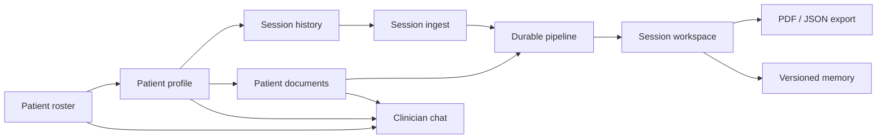

# Features

AI Clinical Scribe — a single-clinician prototype that turns visit transcripts (or PDFs / doctor notes) into verified findings, SOAP notes, insights, and versioned patient memory, with a tool-using clinician chat assistant on top.

Related docs: [Architecture](./ARCHITECTURE.md) · [Customer journey](./CUSTOMER-JOURNEY.md)

---

## Feature map

---

## 1. Patient roster & navigation

| Capability | Detail |
|------------|--------|
| Roster home | `/` lists patients from `GET /api/patients` (falls back to mock data if the API fails) |
| Search | Client-side filter on name, MRN, phone, email, DOB |
| Sort | shadcn `Select` with labels: **Last updated**, **Name (A–Z)**, **Name (Z–A)** |
| Patient cards | Avatar initials, MRN / age / gender, contact line, up to 3 recent sessions, link to profile |
| Empty / loading | Skeleton list; dashed empty state when search yields no matches |
| FAB chat drawer | Fixed bottom-right **CW** button in `ClinicalShell` opens a right `Sheet` with Clinical Chat |

---

## 2. Patient profile

Route: `/patients/[id]`

- Header with back link, patient name, and **Create session**
- Demographics card: avatar, MRN, DOB (with age), gender, phone, email
- Tabs with icons:
  - **Sessions** (`RiHistoryLine`) — searchable session history
  - **Documents** (`RiFileTextLine`) — patient document library
- Session list: date, visit type, status badge (Complete / Processing / Failed / Pending), link to `/session/[id]`
- Session search by date, visit type, or status
- Empty sessions CTA opens the create-session dialog

---

## 3. Patient documents

UI: `PatientDocumentsSection` on the Documents tab

| Capability | Detail |
|------------|--------|
| Upload Dialog | Title, file picker, **Add document** flow |
| Document types | shadcn `Select`: lab, imaging, referral, discharge, other |
| Storage | Supabase Storage bucket `patient-docs` (private, 20MB limit); path `{patientId}/{documentId}-{filename}` |
| Allowed files | PDF + common images (JPEG, PNG, WebP, GIF, HEIC/HEIF) |
| Extraction | PDF text via `unpdf`; images stored without OCR (summary notes OCR not available in v1) |
| Summary | LLM 1–3 sentence clinical summary (`generateObject`) when text is available |
| List / delete | List with type badge, size, date; download + delete; `DELETE` removes DB row + storage object |
| Pipeline hook | Step `loadPatientDocuments` injects recent doc titles/types/summaries into session `agent_metadata` for insights |

APIs: `GET/POST /api/patients/[id]/documents`, `DELETE /api/patients/[id]/documents/[documentId]`

---

## 4. Session ingest

| Input path | How |
|------------|-----|
| PDF (UI) | Create-session Dialog uploads multipart PDF → `input_type: "pdf"`; text extracted with `extractTextFromPdf` |
| JSON API | `POST /api/sessions` with `input_type`: `transcript` \| `doctor_notes` \| `pdf`, plus `raw_text`, `patient_id`, `visit_type` |
| Segmentation | `segmentTranscript` splits raw text into `source_lines` (speaker + text + line ids) before the workflow starts |
| Kickoff | Session row created (`pending` → `processing`); Vercel Workflow `processSession` started; client navigates to session workspace |

Visit type default: `general_adult_outpatient`. PDF UI notes text-based PDFs only (scanned images not supported for session ingest yet).

---

## 5. Durable clinical pipeline

Orchestration: Vercel Workflow SDK (`"use workflow"` / `"use step"`). Progress persisted and streamed via SSE (`/api/sessions/[id]/progress`).

| Step | What it does |
|------|----------------|
| `extractFindings` | LLM extracts structured clinical findings from source lines |
| `verifyFindings` | Grounds findings against source lines (see verification below) |
| `structureSoap` | Organizes verified findings into Subjective / Objective / Assessment / Plan |
| `flagCompleteness` | Flags missing fields / contradictions for the visit type |
| `loadPatientMemory` | Loads latest longitudinal memory for the patient |
| `loadPatientDocuments` | Loads recent document summaries into agent metadata |
| `generateInsights` | Produces clinical insights (omission risk, diagnostic consideration, longitudinal pattern) |
| `updatePatientMemory` | Merges this visit into a new memory version |
| `writeBack` | Finalizes session status / persistence |

### Verification: spans, NegEx, aliases

- **Evidence spans** — primary check that claimed phrases appear in cited source lines (normalized containment)
- **Clinical aliases** — curated bidirectional acronym/synonym groups (e.g. HTN ↔ hypertension) for span/value matching; no open-ended synonymy
- **NegEx-style negation** — phrase/contraction detectors for denied/absent content; clinician-question context and uncertainty language also considered
- Outcomes drive `verification_status` / `verified` flags used by the workspace and export filters

Failures and cancellations are persisted (`error` / `cancelled`) with failed-step + message on the timeline.

---

## 6. Session workspace UI

Route: `/session/[id]`

| Area | Capability |
|------|------------|
| Processing timeline | Live step list with progress bar while `pending` / `processing`; terminal UI for **Failed** and **Cancelled** with alerts and return-to-patient |
| Header | Breadcrumbs (Patients → patient → session); open transcript; export menu (completed only) |
| Insights | Collapsible panel; type-colored icons (amber for gaps/risks, sky for longitudinal); source-count badges open transcript; **Patient memory** badge opens reason dialog |
| SOAP | Tabbed S/O/A/P with icons; findings as category **chips** (symptom, med, lab, etc.) + cited text |
| Citations | Hover/click finding text highlights linked source lines; opens bottom transcript sheet |
| Transcript sheet | Full source lines with citation highlighting |
| Memory | Snapshot available on insights; dialogs for memory reason and structured fields used |

Statuses surfaced in UI: processing / pending (queued) / complete / error (failed) / cancelled.

---

## 7. Versioned patient memory

- Table/model: `patient_memory_versions` with monotonically increasing `version`
- Each completed visit can produce a new version tied to `source_session_id`
- Structured fields: active problems, chronic conditions, medications, allergies, social history, recent visit one-liners
- Plus a free-text `summary` and `derived_from_session_ids`
- Prior versions retained (supersession tracked); pipeline loads latest for insights and chat tools

---

## 8. Export

`GET /api/sessions/[id]/export?format=pdf|json` — completed sessions only.

| Format | Contents |
|--------|----------|
| **PDF** (patient packet) | Visit summary via `@react-pdf/renderer`: demographics, SOAP narratives + verified findings, key findings, insight titles/summaries — no confidence scores, pipeline flags, or raw transcript |
| **JSON** (clinician) | Full session detail + memory (from memory table or session metadata snapshot) |

UI: session header dropdown downloads either format with a sensible filename.

---

## 9. Clinician chatbot

| Piece | Detail |
|-------|--------|
| Agent | AI SDK `ToolLoopAgent` (`clinicalAssistant`) with OpenAI reasoning (`reasoning: "medium"`, summary streaming) |
| Surfaces | FAB drawer (`ClinicalShell`) and dedicated page `/chat` |
| Tools | `listPatients`, `searchSessions`, `getSessionSummary`, `getPatientMemory`, `listDocuments`, `readDocument`, `askClarifyingQuestion` |
| Approvals | `readDocument` always needs user approval; session summary & memory free for **pinned** patient, otherwise user-approval |
| Pinning | Optional patient pin in chat context (default focus for lookups) |
| UI | `useChat` + tool step labels, approval controls, reasoning accordion, typeset markdown (`react-markdown` + GFM via `typeset` CSS) |
| API | `POST /api/chat` |

---

## 10. Stack summary

| Layer | Choice |
|-------|--------|
| App | Next.js 16 (App Router), React 19 |
| UI | Tailwind CSS 4, shadcn/ui, Remix Icon |
| Data | Supabase PostgreSQL + Storage (`patient-docs`) |
| Orchestration | Vercel Workflow SDK (`workflow`) — durable, resumable steps |
| AI | Vercel AI SDK (`generateObject`, `ToolLoopAgent`, `@ai-sdk/react`) + OpenAI |
| Validation | Zod 4 |
| PDF | `unpdf` (extract), `@react-pdf/renderer` (export) |

---

## Out of scope (not implemented)

No auth portal / multi-tenant login, no Neo4j or graph DB, no OCR for scanned session PDFs or image documents, no EHR write-back beyond this app’s Supabase tables.
